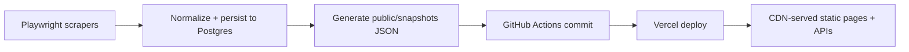

# Performance Architecture

## Target flow

The intent is to keep PostgreSQL as the source of truth for scraping and debugging, while moving public page delivery to small static JSON files that can be cached and shipped cheaply.

## What is precomputed

Each trek snapshot precomputes:

- lowest price
- cheapest organizer
- cheapest package title
- organizer count
- meals summary rollup
- filter metadata for transport, meals, city, and organizers
- row-level search text and timestamp numbers for lightweight client filtering

Each organizer snapshot precomputes:

- package count
- active trek count
- price range
- pickup coverage
- last updated timestamp

Homepage snapshot precomputes:

- featured treks
- organizer count
- trek count
- package count
- price floor
- last updated timestamp

## Snapshot file layout

`public/snapshots/manifest.json`

- all trek slugs
- all organizer slugs
- featured slugs
- pre-render slugs for trek and organizer detail pages

`public/snapshots/homepage.json`

- homepage metrics and featured treks

`public/snapshots/treks/index.json`

- light trek cards for `/treks`

`public/snapshots/treks/search.json`

- small alias index for universal search

`public/snapshots/treks/[slug].json`

- full comparison payload used by trek detail pages and `/api/compare/[slug]`

`public/snapshots/organizers/index.json`

- light organizer cards for `/organizers`

`public/snapshots/organizers/[slug].json`

- full organizer detail payload

## Runtime read strategy

`src/lib/data.ts` follows this order:

1. read the matching snapshot JSON from disk
2. serve it through `use cache` with a long cache lifetime
3. only if the file is missing, fall back to a lean Prisma query using `select`

This keeps public route rendering fast while still making local development resilient when snapshots are missing.

## Query optimization rules

The fallback query layer uses `select`, not `include`, and only reads:

- package fields needed by the UI
- nested organizer name/slug/description
- nested trek name/slug/summary/difficulty/duration
- alias values for search

Do not send these to the frontend unless a public screen truly needs them:

- raw scrape text
- raw snapshots
- debug-only discrepancy data
- full inclusion and exclusion raw arrays

## Caching strategy

Public catalog helpers use long-lived cache profiles:

- catalog pages: 30 minute server revalidation, 1 week expiry
- search index: 6 hour server revalidation, 1 week expiry
- static APIs: `Cache-Control` with `s-maxage=3600, stale-while-revalidate=86400`

The cache is intentionally coarse because updates come from scheduled scrapes and snapshot commits, not user edits.

## Rendering strategy

- homepage, trek index, and organizer index are static routes backed by snapshot data
- trek and organizer detail routes prerender a popular subset of slugs from `manifest.json`
- trek detail pages render summary cards first and lazy-load the interactive comparison table bundle
- the comparison table keeps only cheap client work: filtering against precomputed search text and timestamps

## DB indexing strategy

The database is no longer on the hot path for public page delivery, so indexes should focus on:

- scraper upserts
- fallback detail queries by trek or organizer
- active package scans during snapshot generation

Current useful indexes already present in Prisma:

- `TrekPackage(organizerId, status, lastScrapedAt)`
- `TrekPackage(trekId, status, priceInr)`
- `TrekPackage(nextDepartureAt, priceInr)`
- `Organizer(isActive, sortOrder)`
- `ScrapeRun(scrapeSourceId, startedAt)`

If active package volume grows materially, add an additional covering index led by `status` for snapshot generation scans.

## Performance-focused folder shape

`src/lib/catalog/`

- `builders.ts`: pure snapshot builders and precomputed summary logic
- `queries.ts`: lean Prisma `select` projections
- `generator.ts`: snapshot generation service
- `generate.ts`: CLI entrypoint
- `snapshots.ts`: filesystem read/write helpers

`public/snapshots/`

- deployment-ready JSON payloads served by the CDN

## Vercel recommendations

1. Keep Git-based deployments enabled so snapshot commits trigger new static deploys automatically.
2. Avoid runtime database reads on public pages unless snapshots are genuinely missing.
3. Keep public APIs snapshot-backed and cacheable.
4. Do not add remote cache infrastructure unless traffic grows beyond what snapshot deploys can handle.
5. Keep client bundles small by pushing summary computation and filter metadata into snapshot generation.
6. Prefer prerendered detail pages for popular slugs and let less common slugs fall back to the normal cached route behavior.